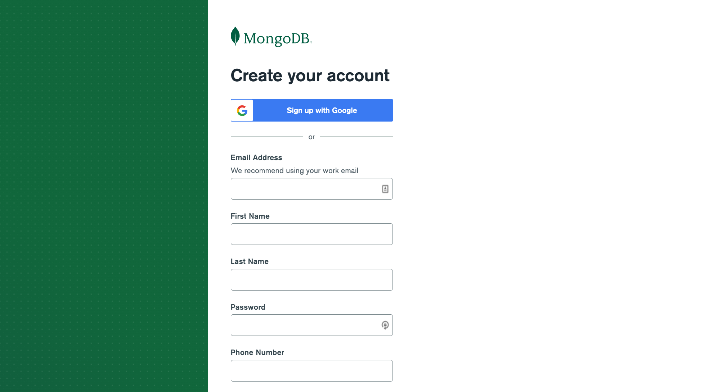
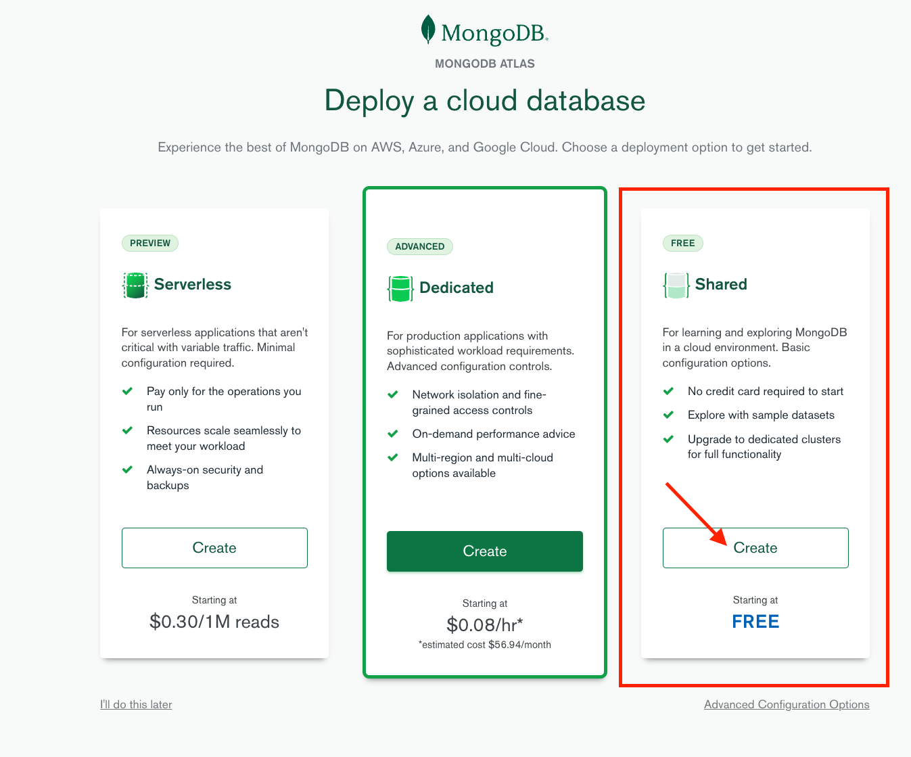
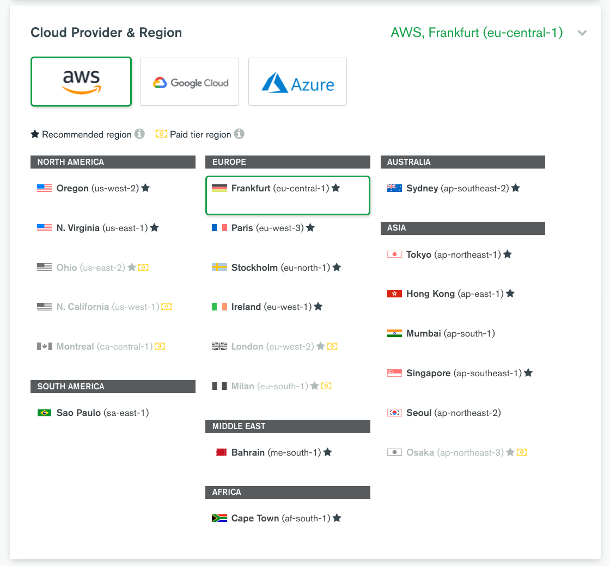
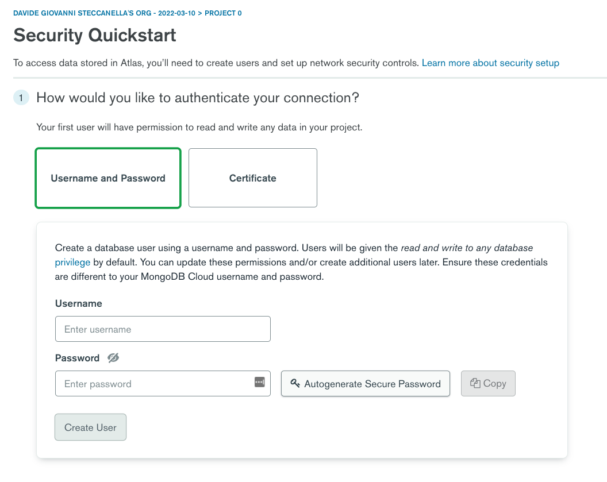
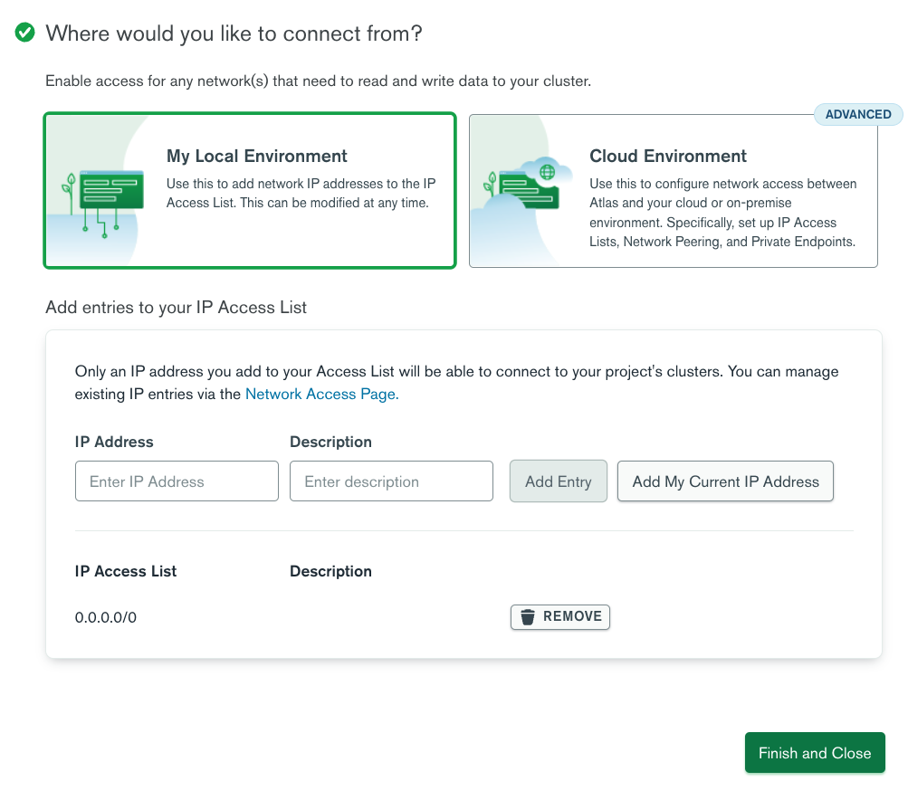

# Database (MongoDB)

| Capitolo precedente  | Capitolo successivo     |
| :--------------- | ---------------: |
| [◀︎ 05-gps-automatico ](../05-gps-automatico )| [07-punti-mappa ▶︎](../07-punti-mappa) |

## Setup MongoDB

MongoDB è un database e permette di memorizzare le nostre sorgenti di acqua pulita. Abbiamo bisogno spesso di un database per memorizzare i nostri dati, in questo caso non è essenziale ma potrebbe essere utile se decideremo in futuro di permettere agli utenti di aggiornare autonomamente le sorgenti o indicarne di nuove.

## Installare il pacchetto di MongoDB

Andrai ad usare il database [MongoDB](https://www.mongodb.com/) attraverso la sua libreria ufficiale per Node.js [mongodb](https://www.prisma.io) che ti permette di interagire con i database con comandi semplici e avanzati. È un ottimo punto di partenza se non sei sicura di quale database utilizzare.

Il pacchetto di cui abbiamo bisogno per iniziare con cui espandere le funzionalità di Remix è:
- `mongodb` per interagire con il nostro database e schema durante lo sviluppo

💿 Installa i pacchetti mongodb:

```sh
npm install mongodb
```
<details>

<summary>Focus: salvataggio pacchetti</summary>

Per salvare i pacchetti, il comando è `npm install nomepacchetto`. I pacchetti possono essere installati in modo che vengano usati sia nell'app in versione finale e costruita che in sviluppo oppure solo in sviluppo. Per dire che quel pacchetto lo vogliamo solo per lo sviluppo, al comando dobbiamo aggiungere `--save-dev` prima del nome del pacchetto, dunque `npm install --save-dev nomepacchetto`

</details>

## MongoDB

Utilizzeremo il Free Shared DB, è gratuito, non è richiesta la carta di credito per iniziare e puoi sfruttare la potenza del database cloud.

1. Vai su <https://account.mongodb.com/account/register?tck=docs_atlas> e crea un account (puoi usare il Sign di Google o creare un account)
  
2. Scegli il `Free Shared` account
  
3. Scegli il cluster geograficamente più vicino a te e crea il cluster.
  
4. In `Security QuickStart`, crea un autenticazione `Username and Password`. Salva queste informazioni perché ne avremo presto bisogno. Crea un utente ad esempio remix_user con una password sicura.
  

Per l'elenco di accesso IP, inseriremo 0.0.0.0 come IP per garantire che il nostro database sia attivo e funzionante rapidamente per lo sviluppo. Ti consigliamo di limitare gli IP per le app di produzione.



6. Sarai ridirezionata a `Database Deployments` che mostrerà `Cluster0`.
7. Clicca il pulsante `Connect` vicino `Cluster 0`
8. Clicca `Connect your application`
9. Copia la stringa di connessione fornita.
10. Nella tua app Remix, crea un file `.env` nella cartella root, quella principale. Questo è un file di ambiente locale in cui memorizzeremo le informazioni dell'URL Mongo contenente nome utente e password per il tuo database. 
11. Apri il file `.env` e inserisci questa variabile, valorizzandola con la stringa di connessione che hai copiato:.

```
DATABASE_URL="mongodb+srv://nomeutente:<password>@twixel.ycwht.mongodb.net/myFirstDatabase?retryWrites=true&w=majority"
```

Al posto del `nomeutente` dovrebbe esserci il nome utente che hai creato, al posto di `<password>` la password creata e invece di `myFirstDatabase` il nome del database che hai appena creato (`Cluster0`)

In questo momento, l'ENV non è accessibile alle funzioni presenti negli altri file. Quando proveremo ad accedere al `DATABASE_URL`, avremo degli errori. Per questo, bisogna installare un pacchetto che si chiama `dotenv` che prende in automatico le variabili presenti nel file `.env` e le carica in una funzione `process.env` che eè accessibile a tutta l'app.

Per installarlo, esegui questo comando nel terminale:

```sh
npm install dotenv --save
```

<details>

<summary>Focus: i file .env</summary>

Un'applicazione, per funzionare, può avere bisogno di informazioni i cui valori cambiano da caso a caso ma che ne costituiscono parti fondamentali per il suo funzionamento. Sono parte del suo ambiente, il suo `environment` - da qui il file `.env`. In questo file, con dei nomi univoci possiamo salvare queste variabili per utilizzarle attraverso tutta l'app, senza ogni volta riscriverle a mano.

</details>

## Connettiti al database

Fino a qui abbiamo messo in piedi il database, ma il problema è che ora, durante lo sviluppo, dobbiamo chiudere e riavviare completamente il server ogni volta che apportiamo una modifica sul server, dato che `@remix-run/serve` ricostruisce effettivamente il nostro codice e lo richiede nuovo di zecca. 

Il problema qui è che ogni volta che apportiamo una modifica al codice, stabiliremo una nuova connessione al database e alla fine esauriremo le connessioni totali a disposizione del nostro piano free!

Quindi abbiamo un po' di lavoro in più da fare per evitare questo problema in sviluppo.

Nota che questo non è un problema solo di Remix ma anche di altri framework. Ogni volta che hai un "ricaricamento in tempo reale" del codice del server, dovrai o disconnetterti e riconnetterti ai database (che può essere lento) o eseguire la soluzione alternativa qui sotto.

💿 Copia il codice in un nuovo file chiamato `app/utils/db.server.ts`:

```ts filename=app/utils/db.server.ts
import { MongoClient } from "mongodb";

const databaseUrl = process.env.DATABASE_URL || ""

let client: MongoClient;

declare global {
  var __db: MongoClient | undefined;
}

// this is needed because in development we don't want to restart
// the server with every change, but we want to make sure we don't
// create a new connection to the DB with every change either.
if (process.env.NODE_ENV === "production") {
  client = new MongoClient(databaseUrl);
  client.connect();
} else {
  if (!global.__db) {
    global.__db = new MongoClient(databaseUrl);
    global.__db.connect();
  }
  client = global.__db;
}

export { client };
```

Ti lasciamo l'analisi di questo codice come esercizio perché, ancora una volta, questo non ha nulla a che fare direttamente con Remix.

L'unica cosa che ti facciamo notare è la convenzione del nome del file. La parte `.server` del nome del file informa Remix che questo codice non dovrebbe mai finire nel browser. 

Questo passaggio è facoltativo, perché Remix fa già un ottimo lavoro nel garantire che il codice del server non finisca nel client. Ma a volte alcune dipendenze del solo server sono difficili da eliminare, quindi l'aggiunta di `.server` al nome del file è un suggerimento per il compilatore di non preoccuparsi di questo modulo o delle sue importazioni durante l'impacchettamento (bundling) per il browser. Il `.server` agisce come una sorta di confine per il compilatore.

## Carica tutte le sorgenti dal dataset pubblico

Per capire nel dettaglio come funziona la ricerca ottimizzata su mappe puoi guardare questo video su YouTube che racconta tutti i dettagli dei servizi che utilizzano strumenti di prossimità geospaziale: https://www.youtube.com/watch?v=M4lR_Va97cQ.

Per generare questi hash ci sono complessi algoritmi e utilizzeremo un pacchetto già pronto chiamato `geokit`:

```
npm install geokit
```

Ora possiamo iniziare inserendo qualche informazione nel database, in modo da avere i nostri primi punti disponibili sulla mappa. Copia i dati iniziali (detti dati seed) in un file `pointsSeed.json` dentro la cartella `app/utils`.

```json filename=app/utils/pointsSeed.json
[
    {
        "name": "BUC - Biblioteca Universitaria Centrale",
        "lat": 46.0599146,
        "lng": 11.1149482
    },
    {
        "name": "Stazione FS Trento",
        "lat": 46.0701811,
        "lng": 11.1241936
    },
    {
        "name": "Tour Eiffel",
        "lat": 48.8583701,
        "lng": 2.2922926
    },
    {
        "name": "Colosseo",
        "lat": 41.8902142,
        "lng": 12.4900422
    }
]
```

💿 Copia questo in un nuovo file chiamato `seed.server.ts` dentro la nuova cartella `app/utils` per caricare tutte le sorgenti dal dataset:

```ts filename=app/utils/seed.server.ts
import { client } from './db.server'
import pointsSeed from './pointsSeed.json';
import { hash } from 'geokit';

const db = client.db()
const collection = db.collection("points")

const pointsWithGeohash = pointsSeed.map(point => {
    return {
        name: point.name,
        lat: point.lat,
        lng: point.lng,
        hash: hash({ lat: point.lat, lng: point.lng })
    }
});

collection.insertMany(pointsWithGeohash)
```

Sentiti libera di aggiungere tutte le sorgenti che vuoi nel file `pointsSeed.json`.

Ora dobbiamo solo eseguire questo file. L'abbiamo scritto in TypeScript per assicurarci di usare i tipi corretti (questo è molto più utile quando l'app e i modelli di dati crescono in complessità). Quindi avremo bisogno di un modo per eseguirlo.

Le variabili `db` e `collection` sono utilizzate per collegarsi al database online, stiamo utilizzando il file `db.server.ts` creato in precedenza che già conosce come collegarsi.

Capita spesso però che i dati che dobbiamo importare non siano completi o nella struttura corretta: la funzione `map` è molto utile quando hai tanti dati che richiedono il nostro intervento. In sintesi ogni oggetto viene trasformato utilizzando la funzione descritta. Nel nostro caso la funzione si occupa di ritornare un oggetto identico con `name`, `lat` e `lng`, ma aggiungendo un hash generato dalla nostra nuova libreria di geohashing.

La potente funzione `insertMany` permette di caricare in modo massivo tutti i nostri dati direttamente nel database.

<details>

<summary>Focus: Typescript</summary>

Javascript è un linguaggio di progammazione che aggiunge ai siti web interattività e funzionalità, a esempio salvare un post quando clicchi un bottone oppure ricaricare una pagina quando fai pull-to-refresh.

Typescript è simile a Javascript, ma aggiunge un livello di controllo ulteriore per facilitare la scrittura di app grandi e complesse. Quando scrivi una app web, può capitare di fare uso di tanti tipi di oggetti con caratteristiche differenti. A esempio. l'oggetto `libro` è fatto da un totale di pagine, che è un `numero` e da un testo, che è una `stringa`. Inserire una stringa nel numero totale di pagine potrebbe portare a bug imprevisti. Con Typescript definisci a priori tutti i tipi e i modelli di dati che usi, in modo da avere controlli automatici che effettivamente i valori che stai usando siano sempre quelli corretti per l'oggetto in uso.

</details>

## Gestione Typescript

💿 Installa `esbuild-register` come dipendenza di sviluppo:

```sh
npm install --save-dev esbuild-register
```

💿 E ora possiamo eseguire il nostro file `app/utils/seed.server.ts` con quello:

```sh
node --require dotenv/config --require esbuild-register app/utils/seed.server.ts
```

Ora il tuo database ha dei punti geospaziali caricati! Se torni sul sito di MongoDB e clicchi `Broswe Collections` potrai vedere i tuoi dati online sotto la voce `test`/`points`!

## Focus: il package.json

Il file `package.json` contiene la lista di tutti i pacchetti che hai installato (a esempio `mongodb` poco fa) ma anche delle azioni da far fare quando esegui certi comandi, come `npm run dev`.

| Capitolo precedente  | Capitolo successivo     |
| :--------------- | ---------------: |
| [◀︎ 05-gps-automatico ](../05-gps-automatico )| [07-punti-mappa ▶︎](../07-punti-mappa) |